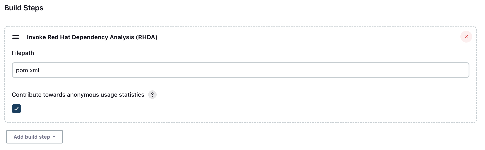
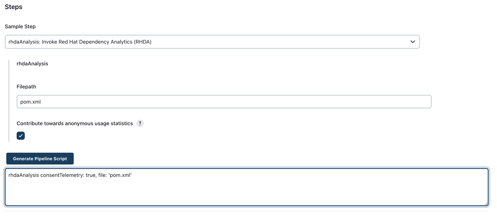
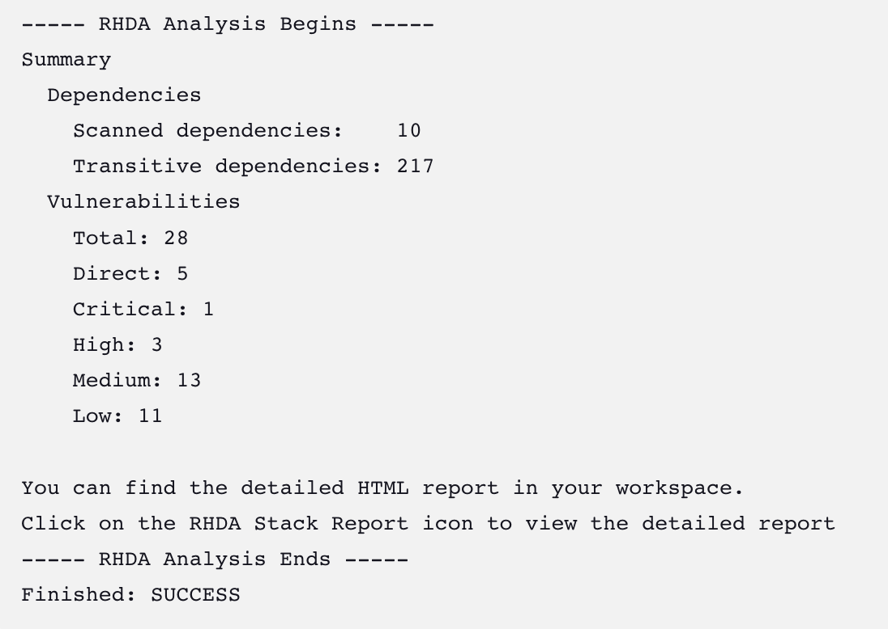
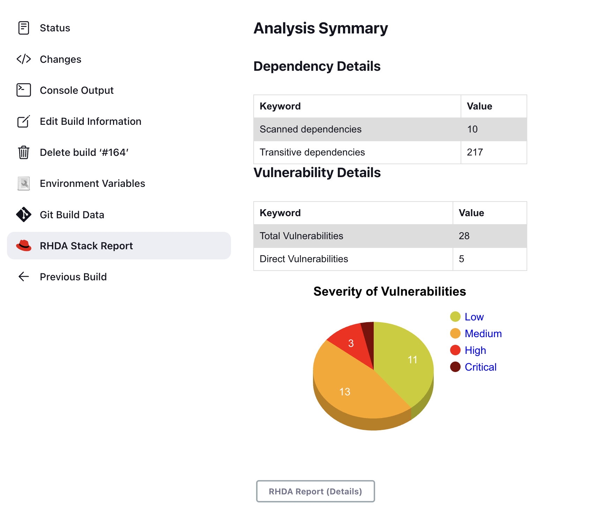
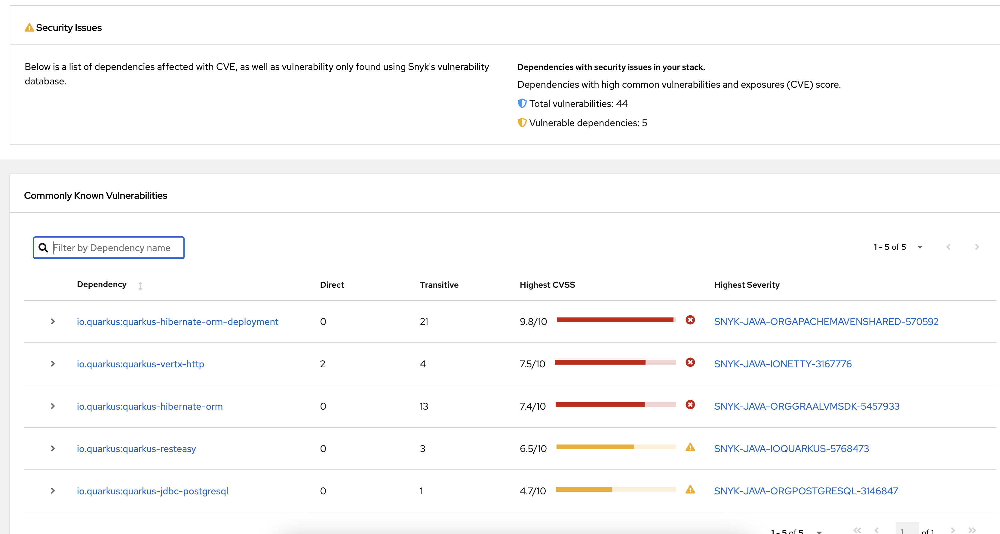

***

# Table of Contents
- [Introduction](#red-hat-dependency-analytics)
- [How To Use The Plugin](#how-to-use-the-plugin)
  - [Admin Steps](#admin-steps)
    - [Install The Plugin](#1-install-the-redhat-dependency-analytics-jenkins-plugin)
    - [Configuration](#2-configuration)
      - [1. Build Step](#option-i--as-a-build-step)
      - [2. Pipeline Task](#option-ii--as-a-pipeline-task)
- [Results](#results)
  - [1. Console Output](#1-console-output)
  - [2. RHDA Stack Report](#2-rhda-stack-report)
  - [3. Detailed RHDA Stack Report](#3-detailed-rhda-stack-report)
- [Snyk Registration](#snyk-registration)
  - [1. Via SNYK website](#1-via-snyk-website)
  - [2. Via CLI](#2-via-cli)
  - 
# Red Hat Dependency Analytics
Red Hat Dependency Analytics (RHDA) is a Jenkins plug-in developed by **Red Hat Inc**. RHDA is powered by **Snyk Intel Vulnerability DB**, which is the most advanced and accurate open source vulnerability database in the industry. It adds value with the latest, fastest and more number of vulnerabilities derived from numerous sources.

'RHDA Report' with Insights about your application dependencies:
- Flags a security vulnerability(CVE) and suggests a remedial version
- Shows Github popularity metrics along with latest version
- Suggests a project level license, check for conflicts between dependency licences
- AI based guidance for additional, alternative dependencies

The plugin can be used in Jenkins as a pipeline task or as a build step.

## How to use the plugin
### Admin Steps
### 1. Install the redhat-dependency-analytics Jenkins plugin
- From the Jenkins Dashboard, click **Manage Jenkins** -> **Plugins** -> **Available Plugins**.
- If Maven is not installed, search for _Maven Integration_, and install the plug in.
- Search for _redhat-dependency-analytics_, and install the plug in.
- Restart Jenkins.

### 2. Configuration
Make sure that the Path is updated to point to the corresponding executables, like `mvn`, `pip` etc.
<h5>Customization</h5>

There is a way to set a custom Maven path using <em>Environment Variables</em>. 

- Click on Manage Jenkins -> System, scroll down to Global properties/Environment Variables.
- Set the corresponding custom path based on your project: 
  - For Maven - Set Name: _EXHORT_MVN_PATH_ and Value: `/path/to/custom/mvn`.
  - For NPM - Set Name: _EXHORT_NPM_PATH_ and Value: `/path/to/custom/npm`.
  - For GO - Set Name: _EXHORT_GO_PATH_ and Value: `/path/to/custom/go`.
  - For Python3 - Set Name: _EXHORT_PYTHON3_PATH_ and Value: `/path/to/custom/python3`.
  - For Pip3 - Set Name: _EXHORT_PIP3_PATH_ and Value: `/path/to/custom/pip3`.
  - For Python - Set Name: _EXHORT_PYTHON_PATH_ and Value: `/path/to/custom/python`.
  - For Pip - Set Name: _EXHORT_PIP_PATH_ and Value: `/path/to/custom/pip`.

If you have a Snyk token, add that as an environment variable:
- Click on Manage Jenkins -> System, scroll down to Global properties/Environment Variables.
- Set the variable name to _EXHORT_SNYK_TOKEN_, and copy-and-paste your Snyk token into the value field.

#### Option I- As a build step
- Click on Configure -> Build Trigger -> Add Build Step. Select `Invoke Red Hat Dependency Analytics (RHDA)`.
- Filepath (Mandatory): Provide the filepath for the manifest file. We currently support the following
	- Maven: pom.xml
	- Python: requirements.txt
	- Npm: package.json
	- Golang: go.mod
- Usage Statistics (Optional): Consent given to red hat to collect some usage statistics to improve the plugin and report. Default consent is false.

  **NOTE:** If you get a Java runtime error because the build can not find the `mvn` binary, try doing the following steps:
  1. From the Jenkins Dashboard, click **Manage Jenkins** -> **Tools** -> **Maven Installations** -> click **Add Maven** -> Enter a name on **Maven Name** -> check **Install automatically** -> click **Save**
  2. From the Jenkins Dashboard, click **Manage Jenkins** -> **System** -> **Check Environment Variables**, click **Add**.
  3. Enter _EXHORT_MVN_PATH_ as the variable name, with the value pointing to the `mvn` binary from the Maven Integration installation.
     For example, a value of `$JENKINS_HOME/tools/hudson.tasks.Maven_MavenInstallation/<Maven Name from Step 1>/bin/mvn`.
  4. Include **Invoke top-level maven targets** as a build step by specifying the Maven version, and add **clean install** as a goal for the new pipeline item.
  
#### Option II- As a pipeline task
- Its just a single line that you need to add in your pipeline script.
`rhdaAnalysis file:'manifest file path', consentTelemetry:true`
The value description remains the same as provided in the Option I.
User can also use the pipeline snippet generator to generate the command.
  
- It returns 3 different exit status code
    - 0: Analysis is successful and there were no vulnerabilities found in the dependency stack.
    - 1: Analysis encountered an error.
    - 2: Analysis is successful and it found 1 or more vulnerabilities in the dependency stack.

## Results
There are a total 3 ways to view the results of the analysis.
### 1. Console Output
This provides the count and types of vulnerabilities found in the dependency stack. This data is generated for every build and can be viewed in the corresponding console log. It also provides a link to the detailed report.

### 2. RHDA Stack Report
After every successful analysis, you can find a new icon added in the left panel named
`RHDA Stack Report` . Click on this icon to view the report in graphical form. Here too, we provide a button to redirect to the detailed stack report UI.

### 3. Detailed RHDA Stack Report
The stack report can be accessed via 2 ways, as mentioned in point number 1 (via url) and 2 (via button click). The report provides comprehensive details about each vulnerability, each dependency in the stack along with the license analysis and the recommended companions.

## Snyk Registration

### Via SNYK website

https://docs.snyk.io/getting-started/quickstart/create-a-snyk-account
